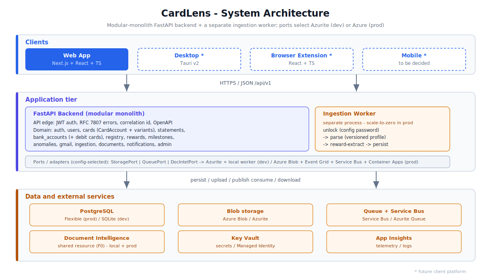
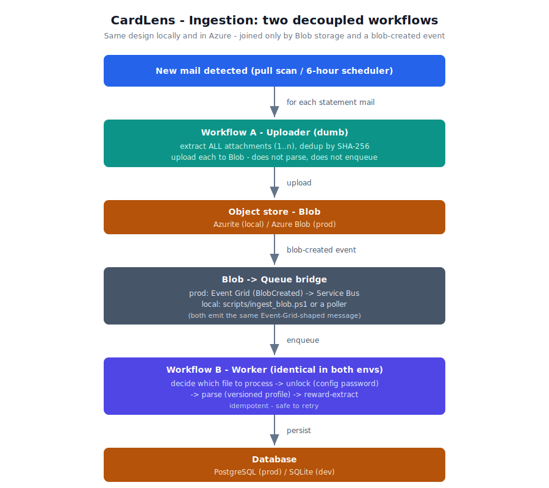

# CardLens

CardLens is a credit-card and bank-account intelligence platform. It reads card and bank statement
emails, unlocks and parses statement PDFs, and surfaces rewards, milestones, fees, anomalies, money
leaks, and card-feature intelligence. It is not a bill-payment app; the focus is tracking, auditing,
optimizing, and alerting.

## 1. Overview

- Connect a mailbox, scan statement emails (pull now, 6-hour scheduler, real-time later).
- Extract structured statement data including mandatory reward-point tracking.
- Match detected cards against a versioned JSON card-feature registry.
- Track milestones, detect fee/charge anomalies, and estimate reward leakage.

## 2. Architecture

CardLens is a modular monolith (one FastAPI backend, strict `router -> service -> repository`
boundaries) plus a decoupled, event-driven ingestion pipeline and a Next.js web client. The same
code runs locally and in Azure - only the adapter configuration changes (Local Environment Parity).

What makes the design hold up under real data:

- Ingestion is split into two independent workflows joined only by Blob storage and a blob-created
  event, so the mailbox reader and the PDF processor scale and fail independently.
- Ports and adapters (`StoragePort`, `QueuePort`, `DocIntelPort`) are selected by config: Azurite +
  a local worker in dev; Azure Blob + Event Grid + Service Bus + a Container Apps worker in prod.
  Switch local to real Azure with one env var, no code change.
- Companion/variant cards are modelled as a `CardAccount` billing aggregate that owns multiple
  network variants (Visa/Mastercard/RuPay/Amex) sharing one statement and one due (pay one, both
  clear), each variant with its own features and reward format. Debit cards hang off a `BankAccount`
  the same way.
- Parser profiles are versioned and config-driven: a new real-world statement layout is a new
  profile version (data), not a code change; low-confidence parses go to a manual-review queue.
- Reward extraction is mandatory and never silently skipped.

### Containers



### Ingestion: two decoupled workflows (same design local and prod)



| Concern | Local (no cloud) | Prod (Azure) |
|---|---|---|
| Object store | Azurite Blob | Azure Blob |
| Queue | Azurite Queue | Service Bus |
| Blob to queue bridge | helper script / poller | Event Grid BlobCreated |
| Worker | local process | Container Apps (scale-to-zero) |
| Document Intelligence | shared Azure resource | shared Azure resource |
| Auth to storage | dev connection string | Managed Identity |
| Secrets | .env | Key Vault |

Detailed module boundaries, data flows, and the domain model: see
[docs/architecture/overview.md](docs/architecture/overview.md) and
[docs/architecture/architecture.svg](docs/architecture/architecture.svg).

## 3. Tech Stack

Backend: Python 3.13, FastAPI, SQLAlchemy 2.0, Alembic, Pydantic v2, pydantic-settings, structlog,
APScheduler, PyJWT, argon2, pypdf, pdfplumber, Azure Document Intelligence (abstracted).
Frontend: Next.js, React, TypeScript, Tailwind, shadcn/ui, framer-motion, ECharts.
Cloud: Azure (Container Apps, Postgres, Blob, Key Vault, Service Bus/Redis, Doc Intelligence,
App Insights). Full table in plan.md.

## 4. Design Decisions

- Python/FastAPI + Next.js product stack; strict-rules process gates adapted to Python (ADR-0001).
- Config-driven everything: bank names, password rules, reward values come from data files, not code.
- Versioned JSON Schema for the card registry so it can evolve without breaking older entries.
- Reward extraction is mandatory and never silently skipped.
See docs/architecture/adr/.

## 5. Layering (SOLID)

- SRP: routers translate HTTP, services hold logic, repositories persist.
- OCP: new banks/parsers/rules added via data files and interface implementations, not edits to core.
- LSP: every parser honors the BaseStatementParser contract.
- ISP: narrow module-local interfaces.
- DIP: services depend on repository and provider interfaces, not concretions.

## 6. Logging

structlog JSON, correlation id per request, ingestion/parser run ids in context, rotating files at
10 MiB under logs/local/ (app, ingestion, parser, scheduler, errors). Secrets, tokens, full card
numbers, and PDF passwords are never logged.

## 7. Run Locally

Backend:

```
./scripts/setup_local.ps1
./scripts/run_backend.ps1
```

Frontend (requires Node 20+):

```
./scripts/run_frontend.ps1
```

## 8. Scripts

setup_local, run_backend, run_frontend, run_all_tests, run_parser_tests, verify_boot, verify_logs,
scan_mailbox_pull, run_scheduler_once, seed_sample_data, generate_postman, run_newman. See scripts/.

## 9. API Documentation

OpenAPI at /openapi.json, Swagger UI at /docs, ReDoc at /redoc. Postman collection in postman/.

## 10. Future Improvements

Real-time Gmail Pub/Sub ingestion, desktop (Tauri), browser extension, mobile, live Azure deploy,
production billing. Tracked in plan.md (Out of Scope) and docs/.
